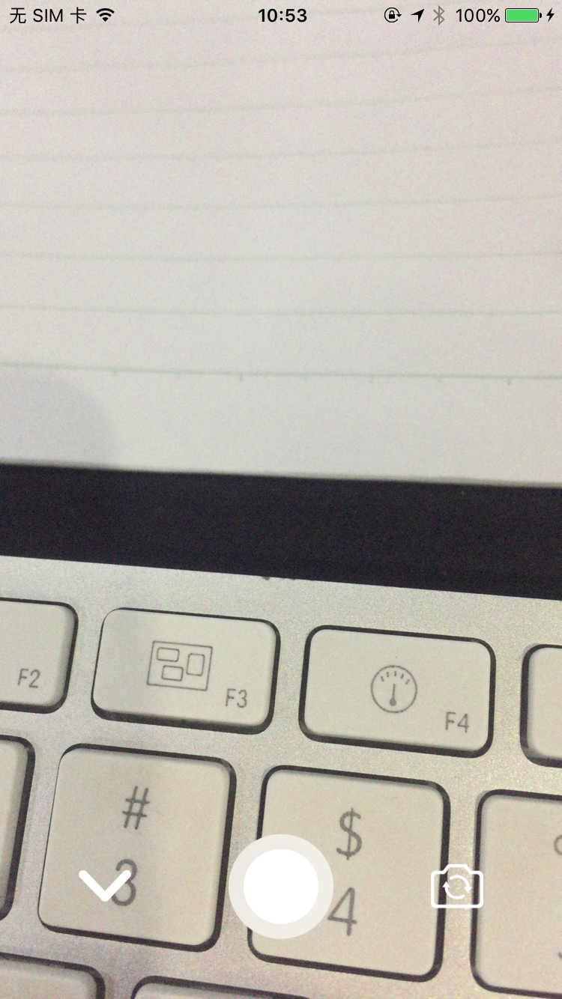

# WMVideo
仿微信录像和拍照，record Video and photo functions exporter
版本支持iOS11.0+
版本支持iOS9.0+ 版本1.0.0

[源码地址](https://github.com/WMSmile/WMVideo)
# 使用

```
        let vc = WMCameraViewController()
//        vc.inputType = .video
        vc.videoMaxLength = 20
        vc.completeBlock = { url, type in
            print("url == \(url)")
            //video
            if type == .video {
              //code
            }
            //image
            if type == .image {
                //code
                           
             }
        }
        present(vc, animated: true, completion: nil)
```

### 展示




